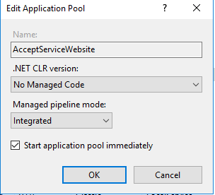

# Accept Suite 

Developer Guide to deploy the .Net Core Web API Application on IIS.

## prerequisite:
*	Windows 10 professional
*	Microsoft visual studio professional 2017
*	Microsoft .Net core 2.1.2 from [here](https://www.microsoft.com/net/download)
*	Internet information services 10

## Deploy .Net Core Application to IIS. 

Please follow step by step procedure to host the above applications to  IIS.

### IIS configuration

Windows desktop operating systems
Enable the IIS Management Console and World Wide Web Services.

* Navigate to Control Panel > Programs > Programs and Features > Turn Windows features on or off (left side of the screen).

* Open the Internet Information Services node. Open the Web Management Tools node.

* Check the box for IIS Management Console.

* Check the box for World Wide Web Services

* Check the box for Internet Information Services Hostable Web Core.

* Restart the system.

### Install the .NET Core Hosting Bundle

Install the .NET Core Hosting Bundle on the hosting system. The bundle installs the .NET Core Runtime, .NET Core Library, and the ASP.NET Core Module. 
 
 
* Navigate to the [.NET downloads page](https://www.microsoft.com/net/download)
* Under .NET Core, select the Download .NET Core Runtime button next to the Run Apps label. The installer's executable contains the word "hosting" in the file name (for example, dotnet-hosting-2.1.2-win.exe).
* Run the installer on the server.
* Wait till the installation is over.

* Once the installation is completed, either restart your system or run below commands in sequence in command prompt:

	net stop was /y
	net start w3svc
	
	The first command will stop the World Wide Web publishing service and the second command will start the service again
	
### Publish  AcceptSuiteService Application with Visual Studio 2017

* Open AcceptSuiteService.sln in Visual Studio 2017

* Build the Application.
* Right-click on the AcceptSuiteService project and select Publish from the menu.
	
	
* Configure the path and choose option File System.
	
	
* After the folder path is set click on Publish Button.
	
	
* Verify the Publish in the Output Section.
	
	
* It will publish the application on the above-mentioned path.
	
	
	
### Create Website on IIS
7.	Open IIS as Administrator.
8.	Right click on sites and select “Add Website”. 
*	Provide Site name and physical path to the app’s deployment folder(C:\inetpub\wwwroot\Publish)
*	Choose https binding.
* 	Select SSL Certificate from drop down.
*   Click OK.

	

#### Under server’s node select Application pools.
* choose the AcceptServiceWebsite Application Pool.
* Right click on the Application Pool and select Basic settings from context menu.
* In the Edit Application pool window, select “No Managed Code”.

	

Check if .Net Core Windows Server Hosting bundle is installed properly
* Next step is to check whether the hosting bundle which we installed earlier is installed properly or not.

* For this click on Modules(in IIS Manager) of your newly created website and search for AspNetCoreModule. If it is available, it indicates that IIS is now aware of how to run a .Net Core application

* ASP.NET Core Module lets you run ASP.NET Core applications on IIS for what it’s good for i.e. security, manageability, and lots more

### browse the website. 
For Instance we will verify one of the API Method Validate Customer.

URL: https://IPAddress:PortNumber/api/AcceptSuite/ValidateCustomer?apiLoginId=78BZ5Xprry&apiTransactionKey=8s2F95Q7brhHd7Tn&customerId=1813212446

