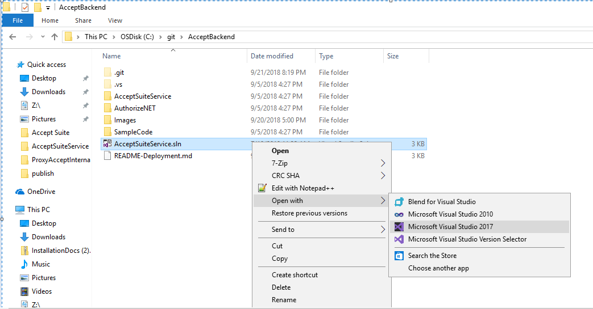
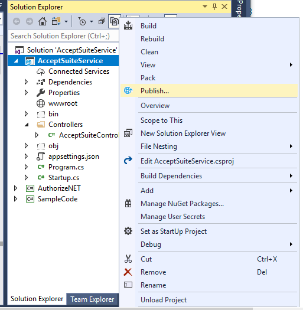
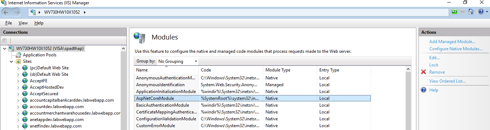
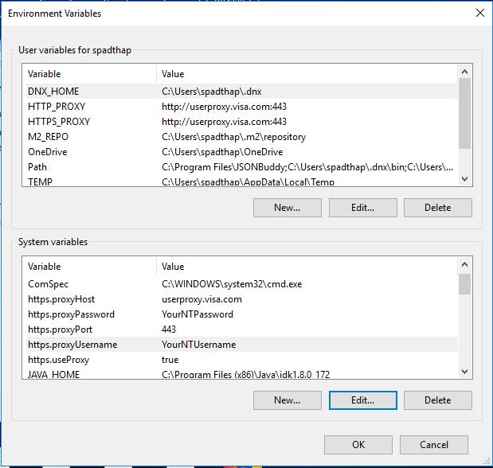

# Accept Suite 

Developer Guide to deploy the .Net Core Web API Application on IIS.

## prerequisite:
*	Windows 10 Professional
*	Microsoft Visual Studio Professional 2017
*	Internet Information Services 10

## Deploy .Net Core Application to IIS. 

Please follow step by step procedure to host the .Net Core Web API applications to  IIS.

### IIS configuration

Windows desktop operating systems

Enable the IIS Management Console and World Wide Web Services.

* Navigate to Control Panel > Programs > Programs and Features > Turn Windows features on or off (left side of the screen).

* Open the Internet Information Services node.

* Check all options for FTP Server.

* Check all options for Web Management Tools.

* Check all options for World Wide Web Services

* Check the box for Internet Information Services Hostable Web Core.

* Click OK and wait till the installation is over.

* Restart the system.

### Install the .NET Core Hosting Bundle

Install the .NET Core Hosting Bundle on the hosting system. The bundle installs the .NET Core Runtime, .NET Core Library, and the ASP.NET Core Module. 
 
 
* Navigate to the [.NET downloads page](https://www.microsoft.com/net/download)
* Under .NET Core, select the Download .NET Core Runtime button next to the Run Apps label. The installer's executable contains the word "hosting" in the file name (for example, dotnet-hosting-2.1.2-win.exe).
* Run the installer on the server.
* Wait till the installation is over.

* Once the installation is completed, either restart your system [**Recommended**] 

				(or)

run below commands in sequence in command prompt:

	net stop was /y
	
	net start w3svc
	
The first command will stop the World Wide Web publishing service and the second command will start the service again
	
### Publish  AcceptSuiteService Application with Visual Studio 2017

* Clone the Repository or Download the source code to local folder.

* Open AcceptSuiteService.sln in Visual Studio 2017

* Select IIS Express from the Debugger Options

* Build the Application.
* Right-click on the AcceptSuiteService project and select Publish from the menu.
	
	
* Configure the path and choose option File System.
	
	
* After the folder path is set click on Publish Button.
	
	
* Verify the Publish in the Output Section.
	
	
* It will publish the application on the above-mentioned path.
	
	
	
### Create Website on IIS

*	Open IIS as Administrator.

*	Right click on sites and select “Add Website”. 

*	Provide Site name and physical path to the app’s deployment folder(C:\inetpub\wwwroot\Publish)

*	Choose  binding type **https** from the drop down and provide the port number.

* 	Select SSL Certificate **IIS Express Development Certificate** from drop down.

*   Click OK.

	

#### Under server’s node select Application pools.

* choose the AcceptServiceWebsite Application Pool.

* Right click on the Application Pool and select Basic settings from context menu.

* In the Edit Application pool window, select .NET CLR version to  “No Managed Code”.

	

Check if .Net Core Windows Server Hosting bundle is installed properly

* Next step is to check whether the hosting bundle which we installed earlier is installed properly or not.

* For this click on Modules(in IIS Manager) of your newly created website and search for AspNetCoreModule. If it is available, it indicates that IIS is now aware of how to run a .Net Core application

* ASP.NET Core Module lets you run ASP.NET Core applications on IIS for what it’s good for i.e. security, manageability, and lots more

## Proxy Configuration

* Go to Environment Variables.

* Click on Environment Variables.

* Add System Variables

	**https.useProxy**
	
	 if https.useProxy is set to true need to provide the values for below system variables.
	
	 if https.useProxy is set to false need not provide the values for below system variables.
	
	**https.proxyHost**
	
	 https.proxyHost value should be **userproxy.visa.com**
	
	**https.proxyPort**
	
	 https.proxyPort value should be **443**
	
	**https.proxyUsername**
	
	https.proxyUsername value should be **Your NTUserName**
	
	**https.proxyPassword**
	
	https.proxyPassword value should be **Your NTPassword**
	
	
	
* Click OK.
	
## browse the website. 

For Instance we will verify one of the API Method Validate Customer.

URL: https://<IPAddress>:<PortNumber>/api/AcceptSuite/ValidateCustomer?apiLoginId=78BZ5Xprry&apiTransactionKey=8s2F95Q7brhHd7Tn&customerId=1813212446

* Sample Request URL

**Validate Customer API**: https://10.173.192.248:3030/api/AcceptSuite/ValidateCustomer?apiLoginId=78BZ5Xprry&apiTransactionKey=8s2F95Q7brhHd7Tn&customerId=1813212446

**Accept JS/UI**: https://10.173.192.248:3030/api/AcceptSuite/AcceptJS?apiLoginId=78BZ5Xprry&apiTransactionKey=8s2F95Q7brhHd7Tn&token=eyJjb2RlIjoiNTBfMl8wNjAwMDUyMkIzMkVGQTMyOURENzIzMkFCRENERTczM0JCQkY5RTEyMDdGOUUyMEQxQzJFNEMwNjk0QTQzNjdCQUY5NDZFMDRFNkNBRkRCOEZFQjA4NDI5MjE5OEQyOUI2ODdDMDc3IiwidG9rZW4iOiI5NTM4OTk0MTEwNDY1ODgzMjA0NjAzIiwidiI6IjEuMSJ9

* Response : 
{"status":true,"successValue":"I00001 Successful.","errorMessage":null}

